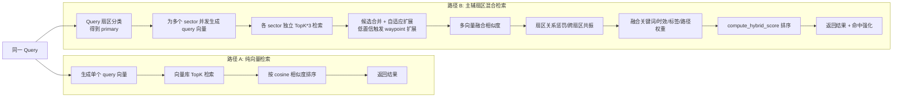

# HSG 主扇区/辅扇区机制说明与纯向量检索对比

## 1. 目标

本文整理 `add_hsg_memory` 与 `query_hsg_memories` 中主扇区（`primary_sector`）和辅扇区（`additional sectors`）的作用，并给出同一 query 在两种检索路径下的对比：

- 路径 A：纯向量检索（仅语义相似度）
- 路径 B：主辅扇区混合检索（多扇区 + 多信号融合）

核心代码参考：`src/memory/hsg.py`

---

## 2. 主扇区与辅扇区在写入（`add_hsg_memory`）中的作用

### 2.1 主扇区（Primary）

主扇区用于定义这条记忆的“主要语义角色”。在 `add_hsg_memory` 中，主扇区直接影响：

1. **记忆标签归属**：写入 `memories.primary_sector`。
2. **衰减策略选择**：从 `SECTOR_CONFIGS[primary].decay_lambda` 取该类记忆的遗忘参数。
3. **后续检索匹配优先级**：查询时用于扇区关系惩罚/放大（`SECTOR_RELATIONSHIPS`）。

### 2.2 辅扇区（Additional）

辅扇区表示“这条记忆在次要语义空间也可被召回”。在 `add_hsg_memory` 中主要用于：

1. **扩展可检索面**：`all_secs = [primary] + additional`。
2. **多扇区向量存储**：`embed_multi_sector(...)` 为多个扇区分别建向量并入库。
3. **显著性初值调节**：`init_sal = 0.4 + 0.1 * len(additional)`（后续 clamp 到 `[0,1]`）。

---

## 3. 主扇区与辅扇区在查询（`query_hsg_memories`）中的作用

查询流程并不只做一次 cosine 检索，而是扇区化分层处理。

### 3.1 查询理解与多扇区向量化

1. 先对 query 分类得到 `query_classify.primary`。
2. 为检索扇区集合批量生成 query 向量：`embed_query_for_all_sectors(query, sectors)`。

### 3.2 多扇区候选召回

1. 每个扇区独立检索：`vector_store.search(query_vector, sector, top_k * 3, filters)`。
2. 合并候选 ID；若平均相似度低，则走 waypoint 扩展召回提升覆盖。

### 3.3 多信号融合排序

对每条候选记忆，综合以下信号：

1. **多向量融合相似度**：`calc_multi_vec_fusion_score(...)`。
2. **跨扇区共振**：`calc_cross_sector_resonance_score(...)`。
3. **主扇区关系惩罚/放大**：`SECTOR_RELATIONSHIPS[query_sec][mem_sec]`。
4. **关键词/Token 重叠**：`compute_keyword_overlap`、`compute_token_overlap`。
5. **时效与遗忘曲线**：`decay.calc_decay(...)`、`decay.calc_recency_score_decay(...)`。
6. **标签匹配与路径权重**：`compute_tag_match_score(...)` + waypoint 权重。

最终由 `compute_hybrid_score(...)` 统一融合。

---

## 4. 为什么不只用纯向量检索

可以只用纯向量检索，但这更像“语义相似度基线”，在记忆场景里通常不够稳。

### 4.1 纯向量检索的优点

- 实现简单，链路短。
- 延迟较低，调参成本小。

### 4.2 主辅扇区混合检索的优势

- **更高精度**：减少“语义相近但类型不对”的误召回。
- **更高召回**：辅扇区让记忆可跨语义空间被命中。
- **更稳排序**：多信号融合弱化单一 cosine 的噪声。
- **更可解释**：可说明命中来自哪个扇区与哪类证据。
- **更可控生命周期**：不同类型记忆可用不同衰减策略。

---

## 5. 同一 Query 的对比流程图（纯向量 vs 主辅扇区混合）

---

## 6. 一句话结论

主扇区决定“这条记忆主要是什么、怎么衰减、怎么被优先匹配”；辅扇区提供“它还可能在哪些语义维度被召回”。这使系统从“单一相似度检索”升级为“语义角色 + 关系 + 时间 +行为强化”的混合记忆检索。

