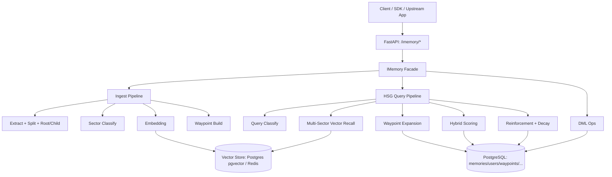
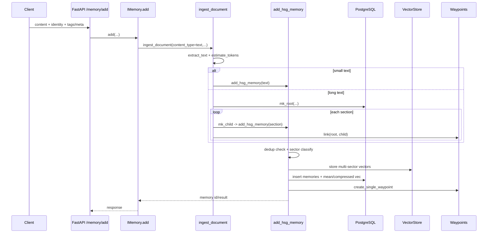
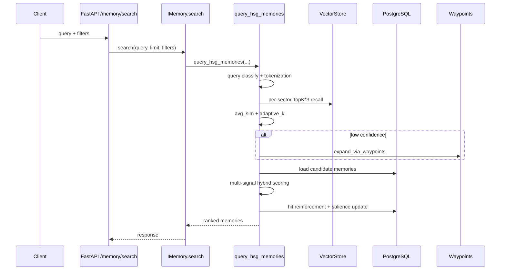

# i-Memory 技术架构文档（面向技术人员）

## 1. 文档目标与范围

本文面向后端工程师、算法工程师、架构师、SRE，说明 i-Memory 的：

- 技术架构分层与模块职责
- 关键技术栈与依赖
- 记忆写入/检索/衰减的主流程
- 数据模型与存储策略
- 可扩展点、性能关注点与工程边界

> 代码基线依据：`src/` 下当前实现（v1.0.0）。

---

## 2. 系统定位

i-Memory 是一个「长期记忆中台」：

- 向上提供 API（记忆写入、检索、历史管理）
- 向下连接关系型存储 + 向量存储
- 中间层实现 HSG（Hierarchical Semantic Graph）检索、混合评分、动态衰减与记忆强化

目标不是简单语义检索，而是构建可持续演化的记忆网络：

- 写入时按主/辅扇区组织，建立向量与关联边
- 查询时综合多信号融合排序
- 使用后自动强化高价值记忆，未使用记忆逐步衰减

---

## 3. 总体架构



---

## 4. 分层设计与核心模块

## 4.1 接口层（Web/API）

- 入口：`src/web/api.py`
- 路由：`src/web/routes/memory_router.py`
- 主接口：
  - `POST /imemory/memory/add`
  - `POST /imemory/memory/search`
  - `POST /imemory/memory/history`
  - `GET /imemory/memory/get/{memory_id}`
  - `POST /imemory/memory/delete`
  - `POST /imemory/memory/clear`

特征：

- FastAPI 生命周期管理与全局异常处理
- 统一响应模型（`agile.web.common_result`）
- CORS 默认放开（生产建议收敛）

## 4.2 领域门面层（Facade）

- 入口类：`src/imemory.py::IMemory`
- 作用：对外暴露一致 API，内部编排 ingest/query/DML
- 方法语义：
  - `add()` -> 文档摄入/记忆写入
  - `search()` -> HSG 检索
  - `history/get/delete/clear()` -> CRUD 与历史分页

## 4.3 摄入处理层（Ingest）

- 文件：`src/ops/ingest.py`, `src/ops/extract.py`
- 关键能力：
  - 多内容抽取：text/pdf/docx/html/url/audio/video
  - token 估算（中文 jieba + 英文分词）
  - 长文本 root-child 切分策略
  - 元数据合并与写入策略选择（single vs root-child）

## 4.4 记忆核心层（HSG）

- 文件：`src/memory/hsg.py`
- 关键函数：
  - `add_hsg_memory()`：分类、去重、分扇区向量化、写向量、建 waypoint
  - `query_hsg_memories()`：多扇区召回、扩展、混合评分、强化回写

## 4.5 算法策略层

- 扇区分类：`src/core/sector_classify.py`
- 混合打分：`src/core/score.py`
- 衰减与再生：`src/memory/decay.py`
- 动态强化：`src/ops/dynamic_memory.py`
- 关键词/token 工具：`src/tools/keyword.py`, `src/tools/text.py`

## 4.6 存储与基础设施层

- 关系库访问：`src/core/db.py`, `src/core/mem_ops.py`
- 向量存储抽象：`src/core/vector/base_vector_store.py`
- Postgres 向量后端：`src/core/vector/postgres_vector_store.py`
- Redis 向量后端：`src/core/vector/redis_vector_store.py`
- 图关系（waypoint）：`src/core/waypoints.py`
- 数据库迁移：`src/migrations/001_initial.sql`

---

## 5. 技术栈清单

## 5.1 语言与运行时

- Python `>=3.12,<3.15`
- 异步模型：`async/await`（检索、向量操作、模型调用）

## 5.2 Web 与模型编排

- FastAPI / Uvicorn
- LangChain（模型调用与结构化输出）
- Pydantic v2（请求模型、领域模型）

## 5.3 存储与检索

- PostgreSQL（业务主存储）
- pgvector（向量列 + HNSW）
- Redis/Valkey（可选向量后端）
- Milvus（辅助能力预留，`IM_VECTOR_MILVUS_SUPPORT`）

## 5.4 AI 模型与供应商

- Provider 抽象：OpenAI / Gemini / DashScope
- Embedding + Chat 模型统一工厂：`src/ai/model_provider.py`

## 5.5 文档抽取与多模态输入

- PDF: `pypdf`
- DOCX: `mammoth`
- HTML: `markdownify`
- 音频转写：OpenAI Whisper API
- 视频抽取：ffmpeg + 音频转写

---

## 6. 数据模型与存储设计

## 6.1 核心表结构

见 `src/migrations/001_initial.sql`，关键表：

- `memories`：主记忆表（内容、主扇区、显著性、时间戳、均值向量等）
- `vectors`：分扇区向量（`PRIMARY KEY(id, sector)`）
- `waypoints`：记忆图边（`src_id -> dst_id` + weight）
- `users`：用户摘要与反思计数
- `segment`：分段游标，用于分段轮转
- `embed_logs` / `stats`：可观测性与日志
- `temporal_facts` / `temporal_edges`：时间事实与关系（预留能力）

## 6.2 多租户隔离字段

多数核心表持有：

- `tenant_key`
- `project_key`
- `user_key`

检索与读写流程中会按该三元组做过滤（具体由 `IMemoryUserIdentity` 传入）。

## 6.3 向量存储策略

- 每条记忆可对应多条 sector 向量（主扇区 + 辅扇区）
- `vectors.v` 默认 `vector(1536)`（受配置影响）
- `memories` 同时存 `mean_vec` 和 `compressed_vec`，用于快速关联与空间控制

---

## 7. 核心流程（端到端）

## 7.1 Add 流程（写入）



关键实现点：

- 去重：与用户已有记忆向量相似度超过阈值（`IM_SIMILARITY_THRESHOLD`）时不新建，仅强化旧记忆
- 分类：`SectorClassifier` 生成 `primary + additional sectors`
- 显著性初值：`0.4 + 0.1 * additional_count`（范围裁剪到 `[0,1]`）
- 向量化：每个扇区独立嵌入并写入向量库

## 7.2 Search 流程（检索）



关键实现点：

- 查询分类后按多扇区并发 embedding（减少等待）
- 每扇区召回 `top_k * 3`，再统一候选池融合
- 低置信触发图扩展：`waypoints.expand_via_waypoints`
- 排序后执行记忆强化与关联传播

## 7.3 Decay 流程（衰减）

- 查询链路中实时使用：
  - `calc_decay()`：按扇区衰减系数 + 时间差计算显著性
  - `calc_recency_score_decay()`：近期度指数衰减
- 命中后更新：
  - `on_query_hit()` 可选触发再嵌入 + 显著性提升
- 后台批处理（`apply_decay()`）已实现框架，可作为定时任务接入

---

## 8. 检索算法细节

## 8.1 扇区建模

系统定义 5 类扇区（`SECTOR_CONFIGS`）：

- `episodic`：情景/事件
- `semantic`：知识/概念
- `procedural`：步骤/技能
- `emotional`：情绪/感受
- `reflective`：反思/洞察

每个扇区有独立：

- `decay_lambda`（遗忘速率）
- `weight`（语义权重）

## 8.2 混合评分

`compute_hybrid_score()` 的核心项：

- similarity（向量相似度，含增强）
- overlap（token 重叠）
- waypoint（图路径权重）
- recency（近期度）
- tag_match（标签匹配）
- kw_score（关键词额外分）

固定权重在 `SCORING_WEIGHTS` 中定义（0.35/0.20/0.15/0.10/0.20），最终过 sigmoid。

## 8.3 关系与共振

- 扇区关系矩阵：`SECTOR_RELATIONSHIPS`
  - 用于 query sector 与 memory sector 不一致时的惩罚/放大
- 跨扇区共振：`calc_cross_sector_resonance_score()`
  - 使用认知共振矩阵对基础分做乘性调制

## 8.4 Waypoint 图扩展

- 新记忆写入时建立单跳最相似关联（`create_single_waypoint`）
- 检索低置信时按边权做 BFS 扩展（`expand_via_waypoints`）
- 扩展权重递减（`*0.8`），低于阈值不再扩展

---

## 9. 配置体系

配置来源：`src/core/config.py` + `.env(.env.dev/.env.test/...)`

关键配置域：

- 模型：`IM_MODEL_PROVIDER`, `OPENAI_*`, `GEMINI_*`, `DASHSCOPE_*`
- 向量后端：`IM_VECTOR_STORE`, `IM_VECTOR_DIM`, `IM_VECTOR_MIN_DIM`, `IM_VECTOR_MAX_DIM`
- 召回阈值：`IM_SIMILARITY_THRESHOLD`
- 衰减参数：`IM_DECAY_THREADS`, `IM_DECAY_COLD_THRESHOLD`
- 其他：`IM_SECTOR_SIZE`, `IM_SUMMARY_MAX_LENGTH`, `IM_USE_SUMMARY_ONLY`

建议实践：

- dev/test/prod 分环境隔离
- API key 通过密钥管理系统注入，避免落盘
- 调整召回阈值前先做离线评估

---

## 10. 接口与调用约定

## 10.1 关键请求模型

位于 `src/web/models/web_models.py`：

- `AddMemoryRequest`
- `SearchMemoryRequest`
- `HistoryMemoryRequest`

## 10.2 过滤器模型

位于 `src/memory/memory_models.py`：

- `IMemoryFilters`：`user_identity/sectors/min_salience/query_mode/config`
- `IMemoryFiltersConfig.graph`：图检索专属配置，类型为 `IMemoryGraphConfig`
  - `enable`
  - `max_hops`
  - `hop_decay`
  - `per_hop_limit`
  - `min_walk_score`
  - `min_relation_confidence`

图检索预设：

- `IMemoryGraphConfig.recall_first()`：召回优先
- `IMemoryGraphConfig.precision_first()`：精度优先

## 10.3 返回模型

- 检索项：`IMemoryItemInfo`
- 可选 debug 字段：`IMemoryItemDebugInfo`

## 10.4 QA 参数语义（方案 B）

### 10.4.1 `query_mode`

用于控制查询时是否启用 QA 配对优先逻辑：

- `prefer`（默认）：优先尝试 QA 配对提升；若条件不满足，自动回退原向量检索
- `qa`：启用 QA 配对优先逻辑（仍基于向量召回候选）
- `vector`：关闭 QA 配对提升，仅使用原有向量检索排序

默认值来源：

- `IMemoryFilters.query_mode = "prefer"`
- `SearchMemoryRequest.query_mode = "prefer"`

### 10.4.2 `qa_role`

写入时的问答角色标记，仅允许：

- `human`
- `assistant`

约束层：

- API/模型层：`QARole = Literal["human", "assistant"]`
- 数据库层：`memories.qa_role CHECK (qa_role IS NULL OR qa_role IN ('human', 'assistant'))`

不传 `qa_role` 时按普通记忆处理（兼容旧逻辑）。

方案 B 的关键点：

- 写入时调用方通常只需传 `qa_role`
- `qa_pair_id` 由系统自动维护：
  - `human`：自动生成新的 `qa_pair_id`
  - `assistant`：自动复用同身份下最近一条未配对 human 的 `qa_pair_id`
- `qa_pair_id` 为内部字段，不作为外部请求参数

### 10.4.3 QA 提升触发条件

`query_hsg_memories()` 中满足以下条件时，会尝试将对应 `assistant` 回答提升到前列：

1. `query_mode` 为 `prefer` 或 `qa`
2. 召回结果中存在 `qa_role = human` 的记忆
3. 该 `human` 记忆有 `qa_pair_id`（方案 B 自动生成）
4. 能通过上述字段在数据库中找到对应的 `assistant` 记忆

若任一条件不满足，系统自动回退原排序链路，不影响既有查询能力。

> 关键设计：配对信息在**写入时**由系统自动固化到每条记忆中，查询方无需管理会话概念。

## 10.5 示例请求与使用建议

### 10.5.1 写入问答对（推荐）

问题（human）：

```json
{
  "content": "OpenClaw是什么，和普通大模型区别在哪？",
  "user_identity": {"user_key": "test_user", "tenant_key": "test_tenant", "project_key": "test_project"},
  "qa_role": "human"
}
```

回答（assistant）：

```json
{
  "content": "它是本地部署的AI智能体执行框架，核心是执行任务，不是只聊天。",
  "user_identity": {"user_key": "test_user", "tenant_key": "test_tenant", "project_key": "test_project"},
  "qa_role": "assistant"
}
```

### 10.5.2 查询（prefer 默认推荐）

```json
{
  "query": "OpenClaw是什么，和普通大模型区别在哪？",
  "limit": 5,
  "query_mode": "prefer",
  "filters": {
    "user_identity": {"user_key": "test_user", "tenant_key": "test_tenant", "project_key": "test_project"},
    "config": {
      "graph": {
        "enable": true,
        "max_hops": 2,
        "hop_decay": 0.8,
        "per_hop_limit": 200,
        "min_walk_score": 0.05,
        "min_relation_confidence": 0.5
      }
    }
  }
}
```

### 10.5.3 实践建议

- 方案 B 下，建议调用方只传 `qa_role`，由系统自动配对
- 若你希望完全复用历史行为，可显式设置 `query_mode = "vector"`
- 对非对话型内容可不传 QA 字段，系统仍按通用记忆处理
- 图检索可按需使用 `IMemoryGraphConfig.recall_first()` / `precision_first()` 作为 presets

---

## 11. 部署与运行（当前工程形态）

## 11.1 基础依赖

- Python 3.12+
- PostgreSQL（建议启用 pgvector）
- 可选 Redis/Valkey（若向量后端切换）
- 若用音视频抽取：需要 ffmpeg

## 11.2 服务启动

当前仓库提供：

- API 入口：`src/web/api.py`
- 运行脚本：`run.sh`（包含环境模式参数）

> 说明：`run.sh` 里包含 Conda 激活和环境变量逻辑，具体是否可直接运行取决于本机环境配置。

---

## 12. 可扩展点

## 12.1 存储层扩展

- 新增向量后端：实现 `BaseVectorStore` 5 个接口即可
- Milvus 全量迁移：已存在接入点（`IMemory._prepare_resource`）

## 12.2 算法层扩展

- 自定义打分维度（用户反馈、业务规则、权限分）
- 自定义 sector taxonomy（从 5 类扩展到业务域分类）
- 引入重排模型（cross-encoder）进行二阶段精排

## 12.3 数据接入扩展

- `sources_router` 已预留外部来源接入路由
- 可接企业 IM、工单、CRM、知识库同步任务

---

## 13. 性能与稳定性关注点

## 13.1 当前优化手段

- 查询缓存：`MEMORIES_CACHE`（默认 TTL 60s）
- 多扇区 embedding 并发生成
- pgvector HNSW 索引
- 低置信自适应扩展，避免全局图遍历

## 13.2 关键瓶颈（当前实现视角）

- 写入去重阶段会扫描用户最近记忆并做相似度比较（用户规模大时成本上升）
- 查询阶段包含多信号融合与多次 DB 访问，尾延迟可能放大
- root-child 大文档写入会触发多次子记忆入库与建边

## 13.3 工程改进建议

- 引入批量写向量/批量读候选减少 RTT
- 将去重阶段改造为 ANN 近邻召回而非逐条比对
- 为热点用户引入分层缓存（query cache + memory profile cache）
- 建立统一压测基线（QPS、P95、召回质量）

---

## 14. 风险与边界

- **一致性边界**：记忆表与向量表跨组件写入，异常时可能出现短暂不一致，建议引入幂等补偿任务
- **模型依赖边界**：扇区分类依赖外部 LLM，可用性与成本受供应商影响
- **多租户治理**：字段层已支持 tenant/project，但生产仍需配套鉴权与审计链路
- **多模态成本**：音视频抽取依赖第三方转写和 ffmpeg，耗时与费用需评估
- **后端差异**：Redis 向量实现与 pgvector 的检索语义/性能不等价，切换前需回归测试

---

## 15. 代码导航（建议阅读顺序）

1. `src/imemory.py`（Facade 主入口）
2. `src/ops/ingest.py`（写入编排）
3. `src/memory/hsg.py`（检索核心）
4. `src/core/score.py` + `src/memory/decay.py`（打分衰减）
5. `src/core/waypoints.py`（图扩展）
6. `src/core/vector/postgres_vector_store.py`（向量后端）
7. `src/migrations/001_initial.sql`（数据模型）

---

## 16. 附录：典型调用路径

- 写入调用链：`memory_router.add -> IMemory.add -> ingest_document -> add_hsg_memory`
- 检索调用链：`memory_router.search -> IMemory.search -> query_hsg_memories`
- 历史查询链：`memory_router.history -> IMemory.history -> mem_ops.all_mem_by_user`

该文档可作为二次开发、架构评审、性能优化与交付对齐的统一技术基线。
