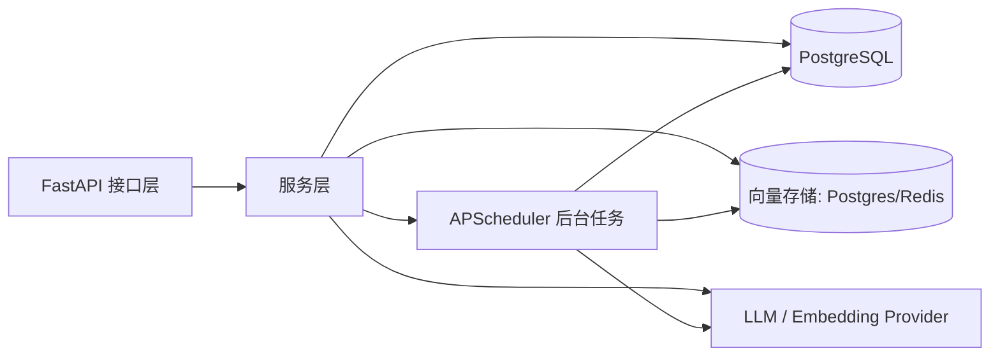

# i-Memory 技术方案说明

> 本文基于当前代码实现整理

## 1. 项目定位

i-Memory 是一个面向对话与知识沉淀的智能记忆系统，核心目标是把原始记忆、会话摘要、用户画像和图谱关系统一管理，并通过混合检索实现“可积累、可召回、可推理”的长期记忆能力。

系统当前以 **FastAPI + PostgreSQL/pgvector + Redis + APScheduler + LLM/Embedding 服务** 为主，支持：

- 记忆写入与去重
- 多扇区向量检索
- BM25、会话摘要、路标、图扩展的混合召回
- 事实图谱构建与关系推断
- 用户画像和会话总结的后台增量生成
- 可选加密存储

## 2. 总体架构

### 分层

| 层级 | 作用 |
|---|---|
| `interfaces` | HTTP API、请求模型、响应封装 |
| `services` | 记忆写入、检索、图谱、画像、会话、调度任务 |
| `domain` | 核心业务模型、枚举、评分与衰减规则 |
| `infra` | ORM、仓储、向量库、AI Provider、数据库/调度基础设施 |
| `shared` | 配置、加密、文本处理、向量工具、JSON 工具 |

## 3. 核心业务流程

### 3.1 写入流程

`POST /imemory/memory/add` 最终进入 `services.memory.hsg.add_hsg_memory()`：

1. 校验用户身份
2. 读取或创建用户
3. 处理 QA 配对字段（`qa_role` / `qa_pair_id`）
4. 生成内容 embedding
5. 计算相似记忆，若超过阈值则走去重强化
6. 文本切分（长文本分块）
7. 记忆分类到 5 个扇区：`episodic / semantic / procedural / emotional / reflective`
8. 摘要抽取，写入 `memories`
9. 多扇区 embedding 写入向量库
10. 计算均值向量、压缩向量
11. 建立 waypoint 关系
12. 更新用户摘要

### 3.2 检索流程

`POST /imemory/memory/search` 进入 `query_hsg_memories()`，当前是多路召回 + 混合评分：

1. 查询分类到目标扇区
2. 生成多扇区 query embedding
3. BM25 召回
4. 向量召回
5. 会话摘要召回
6. waypoint 扩展召回
7. 图谱扩展召回
8. 计算混合评分
9. 叠加衰减、标签、路标、图 bonus
10. QA 模式下提升 assistant 回答
11. 命中后异步强化记忆显著性

## 4. 关键技术点

### 4.1 HSG 混合检索

HSG（Hierarchical Semantic Graph）是当前检索主线，核心不是单纯向量相似，而是多信号融合：

- **向量相似度**：各扇区独立 embedding 后做融合
- **关键词重叠**：BM25 与 token overlap 互补
- **标签匹配**：`tags` 参与评分
- **近期度**：`last_seen_at` 带来时效增强
- **路标权重**：waypoints 表示记忆之间的关联传播
- **图扩展**：topic/fact/entity 图检索结果可额外加分
- **扇区惩罚/共鸣**：不同记忆类型之间有固定关联矩阵

### 4.2 动态记忆机制

`services.memory.dynamic_memory` 实现了两类强化：

- **检索迹强化**：命中记忆后提高自身显著性
- **关联传播强化**：沿 waypoint 向关联节点传播激活

同时结合记忆衰减策略，使高频命中内容更容易被再次召回。

### 4.3 记忆分类

`SectorClassifier` 负责把内容分到 5 个扇区：

- `episodic`：时间、地点、事件
- `semantic`：知识、概念、事实
- `procedural`：步骤、方法、技能
- `emotional`：情绪、感受、态度
- `reflective`：反思、总结、洞察

当前支持两种实现：

- **BERT 分类器**：优先使用本地 checkpoint
- **LLM 分类器**：BERT 不可用时回退

### 4.4 图谱构建

图谱链路由后台任务触发，流程是：

1. `SemanticSpliter` 将对话聚类为 topic
2. `FactExtractor` 从 topic 中抽取 fact
3. `EntityCanonicalize` 将实体规范化到 canonical entity
4. `RelationInference` 通过规则 + LLM 推断实体关系
5. 写入 `graph_topics / graph_facts / graph_entities / graph_canonical_entities / graph_fact_entities / graph_entity_relations`

规则优先，LLM 只做补充推断，低置信度结果会回退到 `CO_OCCURS_WITH`。

### 4.5 会话总结

`SessionExtractor` 从历史对话中抽取 session，要求“一个 session = 一个核心事件”。  
`session_builder` 定时将未参与会话构建的记忆聚合成会话摘要，写入 `sessions`。

### 4.6 用户画像

`UserProfileExtractor` 通过历史对话抽取：

- demographic
- preferences / habits
- attributes
- tags

`user_profile_ops.upsert_user_profile()` 会把新画像与旧画像做深度合并、压缩、再加密存储。

## 5. 数据存储设计

### 5.1 主要表

| 表 | 作用 |
|---|---|
| `users` | 用户主档、摘要、加密密钥、反思计数 |
| `memories` | 原始记忆、摘要、扇区、标签、显著性、是否已参与派生任务 |
| `vectors` | 记忆多扇区向量，默认 pgvector |
| `waypoints` | 记忆间关联边 |
| `sessions` | 会话摘要与对话 ID |
| `user_profiles` | 用户画像快照 |
| `graph_topics` | 图谱主题 |
| `graph_facts` | 结构化事实 |
| `graph_entities` | 原始实体 |
| `graph_canonical_entities` | 规范化实体 |
| `graph_fact_entities` | fact 与 entity 的关联 |
| `graph_entity_relations` | canonical 实体之间的关系边 |
| `embed_logs` | embedding 任务日志 |
| `segment` | 全局分段游标 |

### 5.2 存储策略

- 默认向量后端：**PostgreSQL**
- 可选向量后端：**Redis**
- Milvus：当前只作为可选辅助能力预热，不是默认检索主路径
- 记忆内容、用户摘要支持可选 AES-256-GCM 加密
- `memories` 中的 `profile_joined / session_joined / fact_joined` 用于控制派生任务的增量处理

## 6. API 概览

### 6.1 对外接口

| 路由 | 说明 |
|---|---|
| `GET /imemory/health/` | 健康检查 |
| `POST /imemory/auth/register` | 注册用户 |
| `POST /imemory/memory/add` | 添加记忆 |
| `POST /imemory/memory/search` | 检索记忆 |
| `POST /imemory/memory/history` | 用户历史记忆 |
| `GET /imemory/memory/get/{memory_id}` | 获取单条记忆 |
| `POST /imemory/memory/delete` | 删除记忆 |
| `POST /imemory/memory/clear` | 清空用户记忆 |
| `POST /imemory/memory/user_profile` | 读取用户画像 |
| `POST /imemory/memory/canonical_relations` | 查询 canonical 关系边 |
| `POST /imemory/graph/facts` | 查询用户事实 |
| `POST /imemory/graph/fact/entities` | 查询 fact 关联实体 |
| `POST /imemory/graph/entity/relations` | 查询实体关系 |
| `POST /imemory/graph/entity/topics` | 查询实体关联话题 |
| `POST /imemory/graph/topic/memories` | 查询话题关联记忆 |
| `POST /imemory/graph/explore` | 图探索聚合查询 |
| `POST /imemory/backend/build-graph` | 手动触发图构建 |
| `POST /imemory/backend/build-user-profile` | 手动触发画像构建 |
| `GET /imemory/backend/jobs` | 查询可手动触发任务 |
| `POST /imemory/backend/jobs/{job_id}/trigger` | 手动触发任务 |

## 7. 配置要点

核心配置集中在 `shared.config.settings.EnvConfig`：

- Web：`WEB_HOST / WEB_PORT / WEB_DEBUG`
- PostgreSQL：`DB_HOST / DB_PORT / DB_NAME / DB_USER / DB_PASSWORD`
- Redis：`REDIS_URL / REDIS_USER / REDIS_PASSWORD`
- 模型：`IM_MODEL_PROVIDER / IM_EMBED_MODEL_PROVIDER`
- 向量：`IM_VECTOR_STORE / IM_VECTOR_DIM / IM_VECTOR_MILVUS_SUPPORT`
- 检索：`IM_SUMMARY_MAX_LENGTH / IM_SUMMARY_LAYERS / IM_USE_SUMMARY_ONLY`
- 记忆分类：`IM_USE_BERT_CLASSIFIER`
- 图谱：`IM_GRAPH_BUILD_ENABLE / IM_GRAPH_BUILD_INTERVAL_SECONDS / IM_GRAPH_RELATION_LLM_*`
- 会话：`IM_SESSION_BUILD_ENABLE / IM_SESSION_BUILD_THREADS`
- 画像：`IM_USER_PROFILE_ENABLE / IM_USER_PROFILE_THREADS`
- 加密：`IM_ENCRYPTION_ENABLE`

## 8. 后台任务

由 `infra.scheduler.jobs` 统一注册：

- `memory_decay`：记忆衰减
- `graph_build`：图构建队列扫描
- `force_graph_build`：冷用户强制图化
- `session_build`：会话总结
- `user_profile`：用户画像生成

启动时会按配置创建 `AsyncIOScheduler`，并根据 `GRAPH_BUILD_ENABLE` 启动图构建 worker。

## 9. 当前实现的边界

1. 默认检索主后端仍是 PostgreSQL/pgvector，Redis 仅作为可选替代。
2. 图谱能力依赖 LLM 与规则双通道，质量受模型输出影响。
3. 会话/画像/图谱都依赖后台任务增量处理，首次沉淀可能不是实时完成。
4. 加密开启后，内容和画像字段按用户密钥加解密，调试与排查需要额外注意。

## 10. 结论

当前项目已经形成一条完整闭环：**写入记忆 → 分类与向量化 → 检索与强化 → 会话总结 → 画像沉淀 → 图谱构建 → 反向提升检索质量**。  
技术上最重要的主线是 HSG 混合检索与图谱增强，代码实现已经把接口层、存储层、模型层和后台任务层串成了一套可运行的生产型架构。
