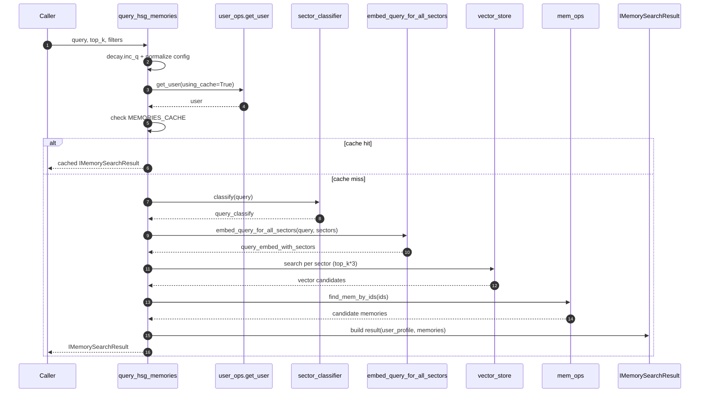
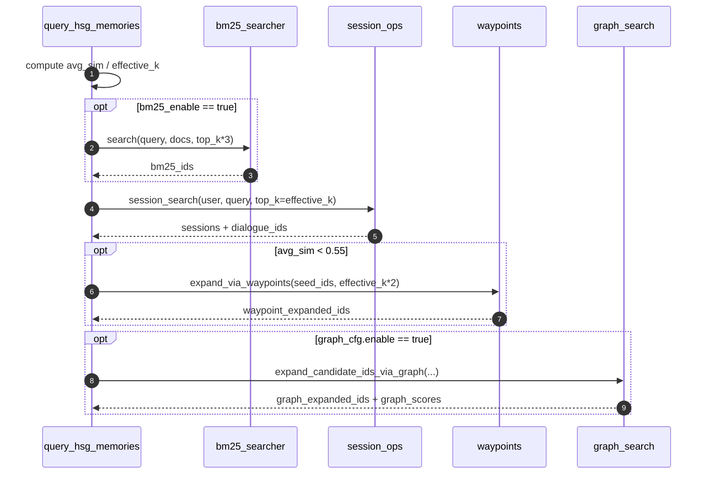
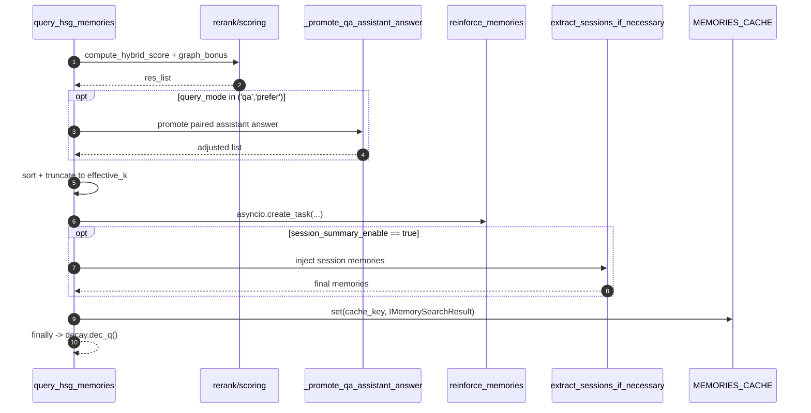

# query_hsg_memories 流程说明

本文对齐 `src/memory/hsg.py` 当前实现，说明 `query_hsg_memories(...)` 的完整执行链路。

## 1. 方法定位

`query_hsg_memories` 是 HSG 检索主入口，负责：
- 统一处理过滤参数、图检索预设和缓存短路
- 多路召回（BM25、向量、会话、Waypoint、Graph）
- 多信号混合打分与重排
- QA 场景答案提升、会话摘要注入、用户画像拼装
- 查询命中后的异步强化（salience/关联传播）

---

## 2. 输入与输出

### 输入参数
- `query: str`：用户查询文本
- `top_k: int = 10`：期望返回条数
- `filters: IMemoryFilters = None`：用户身份、扇区、最小显著性、查询模式与配置项

### 输出结果
- `IMemorySearchResult`
  - `user_profile: UserProfile | None`
  - `memories: List[IMemoryItemInfo]`（按分数降序，通常长度为 `effective_k`，会话摘要开启时可能追加）

---

## 3. 主流程（按执行顺序）

### Step 1: 初始化与配置归一
- `decay.inc_q()` 增加并发查询计数，补齐默认 `filters/config`
- 读取 `filters.config.graph`；若 `type` 为 `recall/precision`，会替换为对应预设参数

### Step 2: 用户身份校验与用户加载
- 对 `filters.user_identity` 执行合法性校验
- `user_ops.get_user(..., using_cache=True)` 获取用户；不存在直接抛错

### Step 3: 缓存短路
- `cache_key = f"{query}:{top_k}:{filters.model_dump_json()}"`
- 命中 `MEMORIES_CACHE` 且类型是 `IMemorySearchResult` 时直接返回（缓存默认 TTL 为 60 秒）

### Step 4: 查询理解与向量准备
- 查询分类：`sector_classifier.classify(content=query)`
- 关键词标准化：`canonical_token_set(query)`
- 扇区范围：优先 `filters.sectors`，否则全扇区；若空回退为 `['semantic']`
- 扇区向量：`embed_query_for_all_sectors(query, sectors)`
- 动态权重：`get_dynamic_sector_weights(primary_sector=...)`

### Step 5: 多路召回（5 路）
- **BM25 路（可选）**：`filters.config.bm25_enable=True` 时，从用户记忆中做关键词召回（`top_k * 3`）
- **向量路（主路）**：每个扇区执行 `vector_store.search(..., top_k * 3)`
- **会话路（L2 摘要）**：`session_ops.session_search(user, query, top_k=effective_k)`，回收 `dialogue_ids`
- **Waypoint 路（低置信触发）**：当 `avg_sim < 0.55`，执行 `waypoints.expand_via_waypoints(..., effective_k * 2)`
- **Graph 路（可选）**：`graph_cfg.enable=True` 时执行 `graph_search.expand_candidate_ids_via_graph(...)`

### Step 6: 自适应规模计算
- 基于向量召回相似度计算 `avg_sim`
- `adapt_exp = ceil(0.3 * top_k * (1 - avg_sim))`
- `effective_k = top_k + adapt_exp`

### Step 7: 候选合并与来源标注
- 合并 5 路 ID 去重后，`mem_ops.find_mem_by_ids(list(ids))` 拉取候选
- 预计算 `kw_scores`（关键词重叠 * 0.15）
- 记录每条记忆首次命中来源：`bm25/vector/session/waypoint/graph`

### Step 8: 单条候选重排打分
逐条记忆执行：
- 基础过滤：`min_salience` 与 `user_id` 强约束
- 多向量融合：`calc_multi_vec_fusion_score(...)`
- 跨扇区共振：`calc_cross_sector_resonance_score(...)`
- 最佳相似度：在当前召回列表中取该记忆最大相似度
- 扇区惩罚：`SECTOR_RELATIONSHIPS` 不匹配时降权
- 时间与记忆状态：`decay.calc_decay`、`decay.calc_recency_score_decay`
- 语义匹配：`compute_token_overlap`、`compute_tag_match_score`
- 图信号加成：`graph_bonus = min(0.12, graph_score * 0.12)`
- 综合打分：`compute_hybrid_score(...) + graph_bonus`，再裁剪到 `[0, 1]`

### Step 9: 结果项构建
- 构造 `IMemoryItemInfo`，在 `metadata` 中补充：
  - `type=memory`
  - `from=<首次命中来源>`
  - `graph_score`、`graph_bonus`
- `filters.config.debug=True` 时填充 `IMemoryItemDebugInfo`

### Step 10: QA 提升、排序与截断
- `query_mode in ('qa', 'prefer')` 时执行 `_promote_qa_assistant_answer(...)`
- 按 `score` 降序，截断到 `effective_k_list = res_list[:effective_k]`

### Step 11: 命中后异步强化
- 通过 `asyncio.create_task(reinforce_memories(effective_k_list))` 异步执行
- 强化包含：命中显著性提升、关联节点传播、`decay.on_query_hit` 事件记录

### Step 12: 用户画像与会话摘要后处理
- 若 `filters.config.user_profile_enable`，加载 `user_profile`
- 调用 `extract_sessions_if_necessary(...)`：
  - `session_summary_enable=True` 时追加 `session:*` 级记忆
  - `session_dedup_enable=True` 时移除会话已覆盖的原始对话记忆

### Step 13: 封装、缓存、返回
- 返回 `IMemorySearchResult(user_profile=user_profile, memories=effective_k_list)`
- 写入 `MEMORIES_CACHE`
- `finally` 中执行 `decay.dec_q()` 回收查询计数

---

## 4. 时序图（sequence-style）

下图分别对应“主路径 / 条件分支 / 后处理”，可与上文 Step 1~13 对照阅读。

### 4.1 主路径总览

### 4.2 多路召回条件分支

### 4.3 重排与后处理

---

## 5. 配置开关速览（`IMemoryFiltersConfig`）

- `bm25_enable`：是否启用 BM25 召回
- `user_profile_enable`：是否返回 `user_profile`
- `session_summary_enable`：是否注入 session 级摘要记忆
- `session_dedup_enable`：是否去掉 session 已覆盖的原始记忆
- `graph`：图扩展配置（含 `recall/precision/custom`）
- `debug`：是否返回调试分量

---

## 6. 关键变化（相对旧版流程）

- 输出从“纯记忆列表”升级为 `IMemorySearchResult`（支持画像 + 记忆）
- 召回由“向量 + 低置信扩展”升级为“5 路并行候选池”
- 新增 Graph 候选分数作为排序附加信号（`graph_bonus`）
- 会话摘要注入/去重在重排后执行，改变了最终列表形态
- QA 提升仍保留，但在新候选池之上进行

